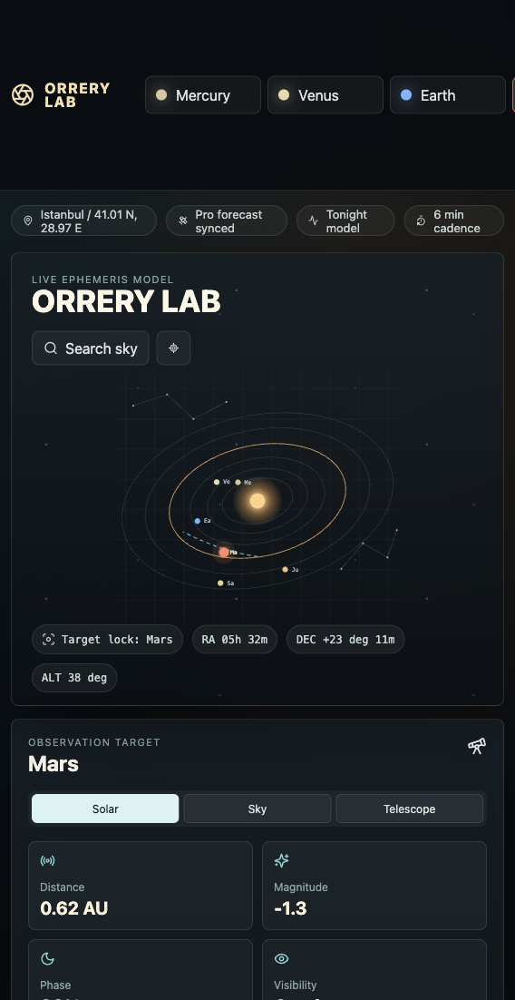
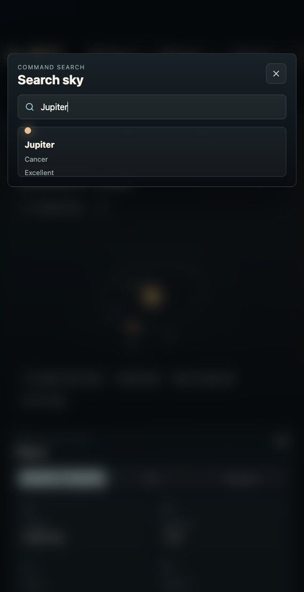
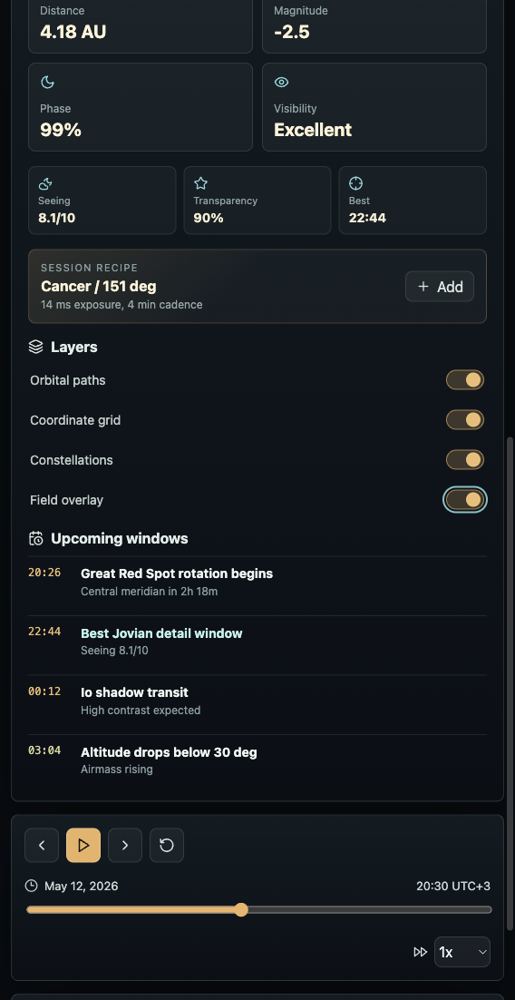

# ORRERY LAB

ORRERY LAB is a polished astronomy visualizer for exploring planetary targets, observation windows, and telescope planning states from one compact command surface.

It is built as a Vite + React single-page app with a custom SVG orbital visualizer, target-aware observation data, local planning state, command search, time controls, and responsive layouts.

## Screenshots

### Live Orrery Dashboard



### Command Search



### Telescope / Field Overlay



## Highlights

- Interactive solar-system style visualizer with orbital paths, trajectory line, constellation layer, sky overlay, and telescope FOV overlay.
- Target-aware data for Mercury, Venus, Earth, Mars, Jupiter, and Saturn.
- Observation inspector with distance, magnitude, phase, visibility, seeing, transparency, best viewing time, exposure, and cadence.
- Command palette for quickly searching planets by target, constellation, or visibility.
- Time scrubber, playback controls, speed selection, and preset model states.
- Session planning flow with add-to-plan feedback and toast confirmations.
- Responsive layout that keeps the app usable on narrow browser viewports.

## Getting Started

Install dependencies:

```bash
npm install
```

Start the development server:

```bash
npm run dev
```

Open the app:

```text
http://localhost:5173/
```

Build for production:

```bash
npm run build
```

Preview the production build:

```bash
npm run preview
```

## Project Structure

```text
.
├── docs/
│   └── screenshots/
│       ├── dashboard.png
│       ├── search.png
│       └── telescope-mode.png
├── src/
│   ├── main.jsx
│   └── styles.css
├── index.html
├── package.json
└── README.md
```

## Interaction Map

- Select a planet from the left rail to update the orrery, inspector, event list, and visibility timeline.
- Use **Search sky** to open the command palette and jump to a target.
- Switch between **Solar**, **Sky**, and **Telescope** modes to change the visual overlay.
- Toggle layers for orbital paths, coordinate grid, constellations, and field overlay.
- Scrub or play time to animate the orbital model.
- Add a target to the observing plan from the session recipe card.

## Data Note

The current app uses curated sample data and local React state. It is designed as a high-fidelity product prototype, not a live ephemeris engine. A production version could connect this interface to astronomy APIs, telescope hardware profiles, weather forecasts, and real observer locations.

## Quality Checks

Current checks performed:

```bash
npm run build
```

Browser smoke tests covered target search, target switching, telescope mode, field overlay, add-to-plan, recentering, and console error checks.
